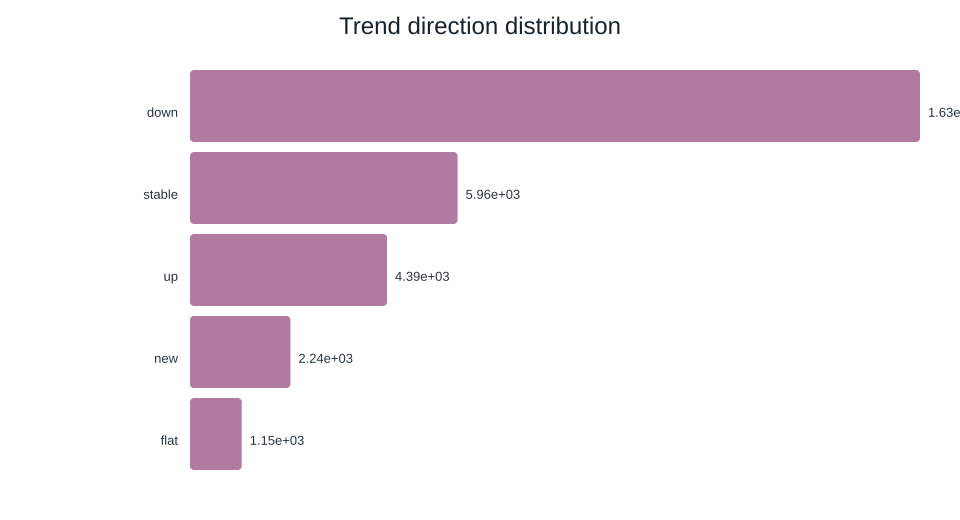
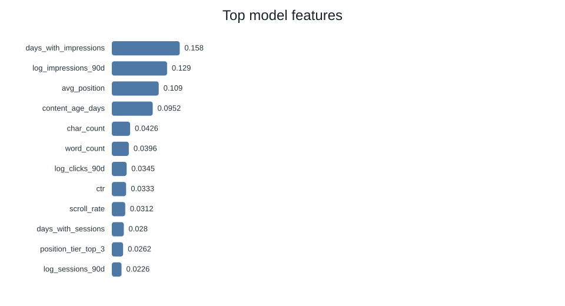
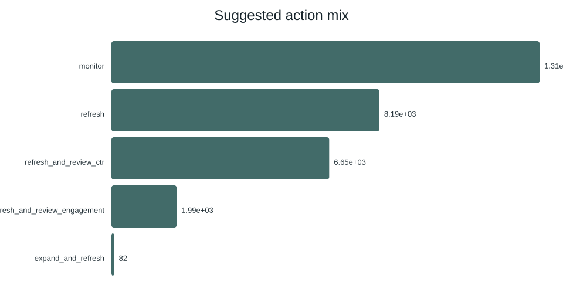
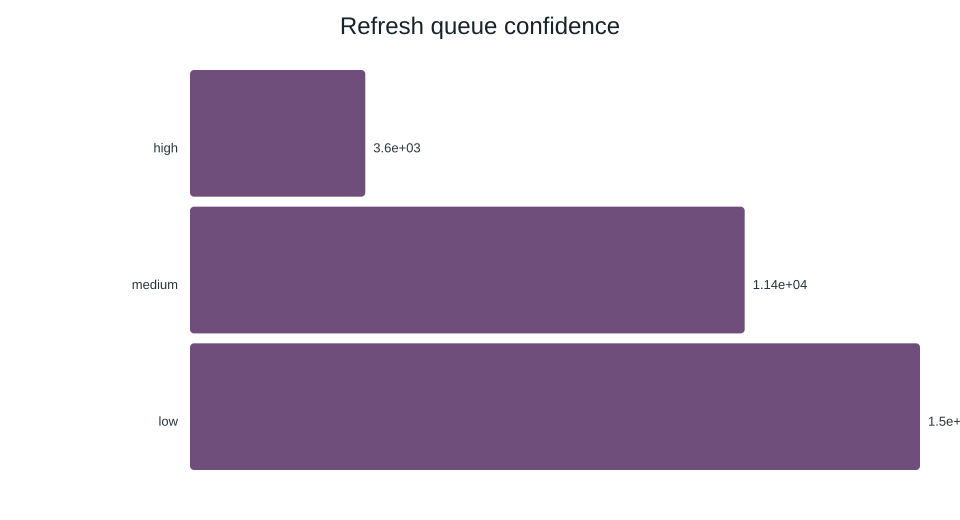
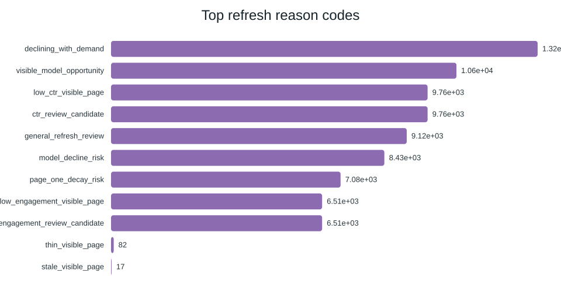

# Refresh and Content Opportunity Scoring: Ranking Existing Pages for Review

*By Raja Rayyan Ameer — FlyRank ML Internship, 2026*

## Abstract

Content teams managing large page inventories need a repeatable way to decide which pages to
review first. This project asks whether a learned model can rank existing content for refresh
review better than a transparent hand-written rule. Using an anonymized 30,000-page slice of
FlyRank search-performance data, we engineered features from observable search and engagement
signals, built a baseline scoring rule, and trained three classifiers under a client-holdout
validation split. A random forest model reached Precision@50 of 0.740 versus the baseline
rule's 0.240, a roughly 3x lift on the same held-out clients. The result supports using the
model as a reviewer aid for weekly refresh triage, not as an automated publishing decision.

## Introduction / Problem Statement

Every content team eventually has more published pages than time to review them. Manually
deciding which of thousands of pages deserve a refresh, a rewrite, a metadata fix, a CTR
review, doesn't scale. A ranked, explainable queue that surfaces the highest-opportunity pages
first turns an unbounded backlog into a weekly, reviewable list.

**The decision this work supports:** which pages a content/editorial team opens and reviews
first this week, out of a much larger backlog. It is not a claim about search-engine ranking
mechanics, and it does not replace editorial judgment.

## Data

- **Source:** `content_refresh_anonymized.csv`, the FlyRank ML Internship starter release,
  30,000 pseudonymized content items across 32 pseudonymized clients.
- **Window:** 90-day trailing activity totals, plus a 30-day/prior-30-day comparison window
  used to derive the trend label.
- **Exclusions:** the release ships with no client names, domains, URLs, page titles, keywords,
  raw search queries, or credentials. `content_id` and `client_id` are pseudonymous hashes used
  only for grouping and validation splits — never as model features.
- **Row filtering:** items with zero impressions or under 90 days of age were dropped;
  duplicate `content_id`s removed.

## Methodology

**Label.** `is_declining_label = (trend_direction == "down")`, derived from a 30-day vs
prior-30-day impressions comparison. Because the label is derived from `trend_direction`,
neither `trend_direction` nor `trend_pct` was ever used as a model feature — verified
explicitly in a dedicated leakage-check pass.

**Features.** Numeric and categorical fields covering visibility (log-transformed impressions,
clicks, sessions), position and CTR, engagement and scroll rate, content age and freshness,
word/character count, and content metadata (content type, main intent, competition level).

**Baseline.** A transparent, weighted hand-rule score: `0.40 × visibility + 0.30 × freshness
risk + 0.25 × position opportunity + 0.05 × depth gap`, with explicit reason codes (e.g.
`stale_visible_page`, `low_ctr_visible_page`) attached to every scored item.

**Models.** Logistic regression, decision tree, and random forest, each trained and evaluated
on the identical split.

**Validation design.** A client-holdout split, roughly 20% of clients withheld entirely, so no
client's pages appear in both train and test. This tests whether the signal generalizes across
clients rather than memorizing per-client baselines.

**Signal audit.** Before trusting any rule, three candidate signals were tested independently
against the decline label: staleness alone (MIXED — not monotonic across freshness tiers),
CTR relative to position tier (CONFIRMED: CTR falls cleanly as position worsens), and word
count alone (MIXED: no clean trend). A combined flag test on the baseline's
`low_ctr_visible_page` rule (CTR below threshold at strong position, with meaningful traffic)
showed an elevated decline rate versus unflagged pages, supporting that rule's design.

## Results

| Model | ROC AUC | Avg. Precision | Precision@50 |
|---|---:|---:|---:|
| baseline_rules | 0.627 | 0.468 | 0.240 |
| logistic_regression | 0.700 | 0.522 | 0.400 |
| decision_tree | 0.742 | 0.575 | 0.540 |
| random_forest | 0.750 | 0.618 | **0.740** |

Random Forest was selected by Precision@50, the metric that matches how the queue is actually
used (a reviewer works through roughly the top 50 items). It delivers a ~3x lift over the
baseline on the same held-out clients. Top contributing features were `days_with_impressions`,
`log_impressions_90d`, `avg_position`, and `content_age_days`, consistent with the signal
audit's finding that position-adjusted, visibility-weighted signals carry more information than
any single flag alone.

*(Charts: `outputs/charts/action_mix.svg`, `confidence_mix.svg`, `top_feature_importance.svg`,
`trend_distribution.svg`, embedded on the deployed page.)*

## Limitations & Honest Framing

- The model predicts an **observed 90-day pattern**, not a forecast, it supports review
  prioritization, not a claim about future search-engine behavior.
- Trained and evaluated on a single **30,000-row anonymized snapshot** covering 32 clients;
  generalization beyond this slice is untested.
- The random forest's exact Precision@50 is **library-version sensitive** (documented range
  ~0.68–0.74); the stable claim is the ~3x lift, not the third decimal.
- Two of three audited signals (staleness, word count) were **MIXED** in isolation, only
  position-adjusted CTR held up cleanly. Single-signal explanations should be avoided.
- No causal or algorithmic claim is made. All findings are **observed, measured, directional,
  and decision-support** in nature.

## Ranked Recommendations

1. **High-Confidence CTR Review:** Visible, well-positioned pages under-capturing clicks;
   review metadata/snippet first (highest-precision, most actionable segment).
2. **Expand Thin Content:** Smallest group, highest leverage: visible pages that are too short
   for their demand.
3. **Standard Refresh:** Declining-with-demand or stale visible pages; the routine queue.
4. **Monitor:** No action needed this cycle; re-score next pass.

## Reproducibility

- Pipeline reference: `scripts/01_prepare_features.py` → `05_build_pdf_report.py`
  (unmodified, run via `scripts/run_all.py`)
- Capstone notebooks: `work/notebooks/w01_research_question.ipynb` through
  `w07_action_playbook.ipynb`, `w04_signal_audit.ipynb`, and `capstone.ipynb`
- Repository: https://github.com/RajaRayyanAmeer/FlyRank-Internship-as-an-ML-Engineer

## Acknowledgments & Data Credit

Built on the FlyRank ML Internship dataset, [flyrank.ai](https://flyrank.ai)